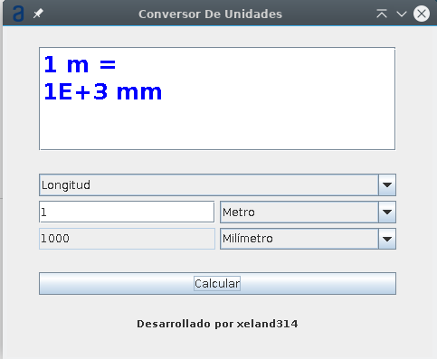

# Conversor de unidades - Challenge #2 de Oracle Next Education (ONE)

## Descripción del proyecto

Este es un proyecto de conversión de unidades desarrollado para el Challenge #2 de Oracle Next Education (ONE). El conversor tiene una interfaz gráfica sencilla y puede realizar conversiones de longitud, tiempo, temperatura y divisas.

## Demo


## Interfaz gráfica



## Funcionalidades

### Tipos de conversiones

Este conversor puede realizar los siguientes tipos de conversión entre sus respectivas unidades:

- Longitud:
  - Milímetros (mm)
  - Centímetros (cm)
  - Decímetros (dm)
  - Metros (m)
  - Decámetros (dam)
  - Hectómetros (hm)
  - Kilómetros (km)

- Tiempo:
  - Segundos (s)
  - Minutos (min)
  - Días (d)
  - Semanas (semanas)
  - Meses (meses)
  - Años (años)

- Temperatura:
  - Celsius (°C)
  - Fahrenheit (°F)
  - Rankine (°R)
  - Kelvin (K)

- Divisas (A la fecha del 25 de abril del 2023):
  - Euro (EUR)
  - Dólar (USD)
  - Yen japonés (JPY)
  - Won surcoreano (KRW)
  - Libra esterlina (GBP)
  - Peso colombiano (COP)

## Herramientas utilizadas

- Lenguaje de programación: Java `(OpenJDK 17.0.6)`
- Interfaz gráfica: Swing
- Gestor de paquetes: Maven
- Control de versiones: Git & GPG
- IDEs: Visual Studio Code (para pruebas unitarias) y Eclipse (para la interfaz de usuario y la compilación)

## ¿Cómo ejecutar el conversor?

Puedes descargar el archivo ejecutable correspondiente a tu versión de Java y ejecutar el comando en tu consola:

### Java 11

```bash
java -jar conversor_11.jar
```

### Java 17

```bash
java -jar conversor_17.jar
```
